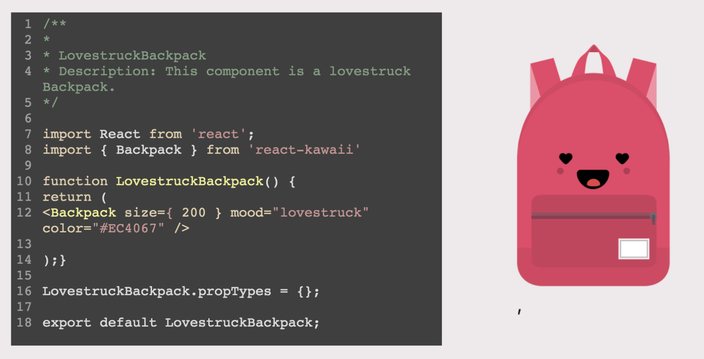

# generate-kawaii-components

CLI tool to quickly generate cute [react-kawaii](https://github.com/miukimiu/react-kawaii) components.


[](https://asciinema.org/a/243203)

Sample output based on above CLI iputs



## Setup:

`yarn`

## Generate component

`plop` and then answer the prompts. Generated component and its associated files will appear in the `/src` directory.

## Structure of a react-kawaii component

```
import { Planet } from 'react-kawaii';

const Example = () => <Planet size={200} mood="blissful" color="#FDA7DC" />;
````


For more information about about [React-Kawaii](https://react-kawaii.now.sh/) components visit https://github.com/miukimiu/react-kawaii or  https://react-kawaii.now.sh/


